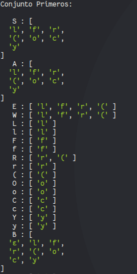
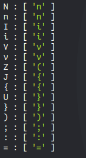
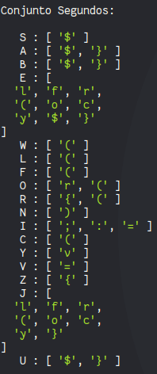
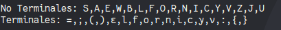
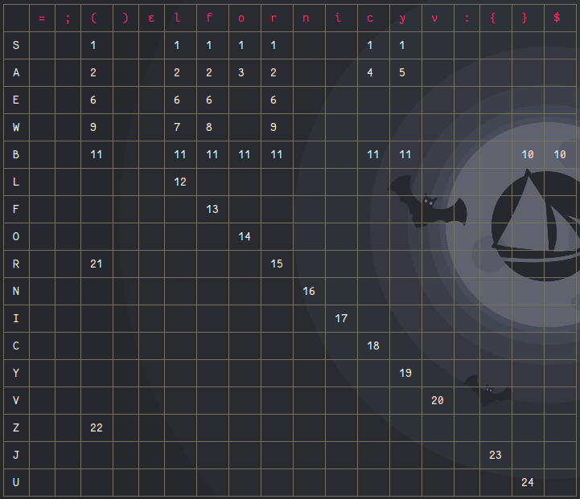
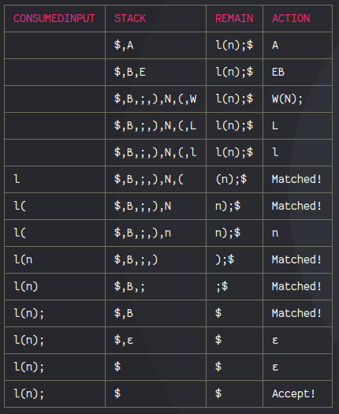
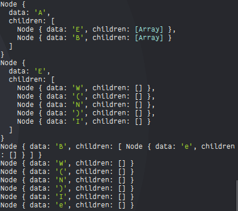

# Analizador Léxico

## Click aqui [DEMO](https://yerson001.github.io/LPgame/)

## Click aqui [DOCUMENTO](https://docs.google.com/document/d/1EuZJ3zqq2_AnlcOfuZDhbMw45RhlynwMO6vKFlFqOqc/edit?usp=sharing)
## programa sin errores
~~~
fordware(10);
right(90);
left(90);
FOR(i:5){
  if(d==i)[
    fordware(5);
    left(90);
 ]
}
fordware(3);
right(90);
~~~
## BUCLE FOR
~~~
fordware(1);
FOR(i:4){
 fordware(3);
 right(90);
}
~~~
## ZIGZAG
~~~
fordware(3);
right(90);

FOR(i:4){
  fordware(1);
  left(90);
  fordware(1);
  right(90);
}
~~~

## programa con errores
### Si no corrige los errores, el pograma no podrá continuar
~~~
fordware(1r);
right(90);
left(92);
int d = 0;
FOR(y){
  if(d==i){
    fordware(5);
    left(90);
 }
}
fordware(3);
right(90);
~~~

## Gramática
~~~
S->A
A->EB
A->O(I:N){B}
A->C(I==I){B}
A->YV=I;B
E->W(N);
W->L|F|R
B->e|A
L->l
F->f
O->o
R->r
N->n
I->i
C->c
Y->y
V->v

~~~
## Producciones
~~~
1. FOR(i:n){..]
    o(i:n){r(n);}
2. int a=0; FOR(i:4){..left(n); right(n);...};
    yv=i;f(n);l(n);o(i:n){f(n);l(n);}
3. IF(..){...}
    c(i==i){l(n);}
4. FOR--IF
    o(i:n){r(n);c(i==i){l(n);}}
~~~
## Conjunto primeros

## Conjuto de segundos

## Terminales y no terminales

## Tabla ll1

## TEST producciones

## Arbol de derivaciones

